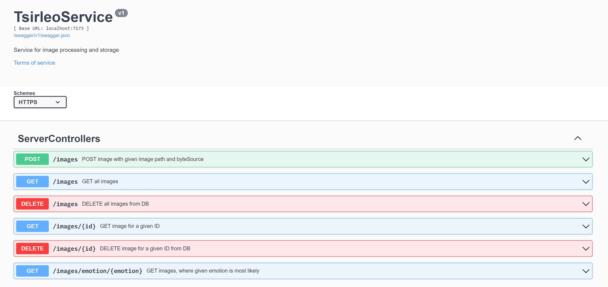

# **Task_4**
**Сервер и WPF-клиент**:
- ***Сервер*** проводит проводит обработку изображений и их хранение, с использованием модели машинного обучения (***NuGet-пакет***, создаваемый библиотекой **Task_1**) для определения вероятности эмоций на изображении, а также базу данных (**Proccessed_Images.db**). Добавлена поддержка OpenApi.
- ***Клиент*** с помощью http-запросов получает информацию от ***Сервера***. WPF-клиент не генерируется из .json-файла из-за ошибки. Общение клиента с сервером происходит с использованием классов библиотеки [***Contracts***](https://github.com/tsirleo/Lab_DotNET/blob/master/Task_4/Contracts/DatabaseClasses.cs).

О формировании пакета и работe с ним см. в файле [README](https://github.com/tsirleo/Lab_DotNET/blob/master/Task_1/README.md) внутри соответствующего каталога.

Про работу с базой данных и работе с ней см. в файле [README](https://github.com/tsirleo/Lab_DotNET/blob/master/Task_3/README.md).

## **Для запуска программы:** 
**1. Перейти в директорию Task_1/ModelLib:**
```
cd ../Task_1/ModelLib
```
**2. Сформировать пакет NuGet:**
```
dotnet pack
```
**3. Перейти в директорию Task_4/Server:**
```
cd ../../Task_4/Server
```
**4. Добавить миграции в проект:**
```
dotnet ef migrations add InitialCreate
```
**5. Создать базу данных и схему из миграции:**
```
dotnet ef database update
```
**6. Запустить сервер:**
```
dotnet run
```
**7. Перейти в директорию Task_4/WPFApp_Client:**
```
cd ../Task_4/WPFApp_Client
```
**8. Запустить клиентское приложение:**
```
dotnet run
```
### Логгирование:
Сервер поддерживает возможность логгирования 2 способами:

1. По умолчанию логгирование в консоль.
2. Логгирование в файл ***http_logger.log***. Для переключения режима необходимо в [файле Program.cs](https://github.com/tsirleo/Lab_DotNET/blob/master/Task_4/Server/Program.cs):
    - закомментировать строку:
        ```
        builder.Logging.AddConsole(); // if you want server to log in console
        ```
    - снять комментарий со строки:
       ```
       //builder.Logging.AddFile(Path.Combine(Directory.GetCurrentDirectory(), "http_logger.log")); // if you want server to log in file
       ```
### Сервер и спецификация swagger:
- Клиент с сервером общаются по защищенному протоколу ***https***. Сервер по умолчанию запускается на порту ***5072*** при использовании ***http***, и на порту ***7173*** при использоовании ***https***. Если необходимо использовать другой порт - требуется внести изменения в [файл](https://github.com/tsirleo/Lab_DotNET/blob/master/Task_4/Server/Properties/launchSettings.json), а также в [файле](https://github.com/tsirleo/Lab_DotNET/blob/master/Task_4/WPFApp_Client/MainWindow.xaml.cs) клиента указать этот другой порт в переменной ***apiUrl***.
- К серверу добавлена поддержка OpenAPI - по адресу "https://localhost:7173/swagger/v1/swagger.json" находится спецификация .json. Api можно найти по адресу - "https://localhost:7173/swagger/index.html#/ServerControllers".



## **Условие:** 
Требуется создать распределенное приложение, в котором сервер выполняет задачу анализа изображений  и работу с хранилищем результатов анализа, а клиент предоставляет пользовательский интерфейс.

### **Требования к реализации:** 
#### 1. Создан сервис на основе технологии ASP.NET Core Web Api. Сервис предоставляет API в стиле REST для решения следующих задач: 
- ***POST*** массива изображений в ресурс ***/images*** проводит анализ изображений и добавляет изображения в базу данных, если таких изображений ещё не было.
- ***GET*** ***/images/happiness*** возвращает все изображения с максимальной вероятностью эмоции счастья. Аналогично для других типов эмоций.
- ***DELETE*** ***/images*** очищает хранилище.
#### 2. Создана спецификация сервиса на языке OpenApi. По спецификации автоматически сгенерированы классы клиента, с которыми работает приложение.
#### 3. Приложение WPF обращается для выполнения распознавания и хранения результатов к сервису из п.1.
-  Вся функциональность приложения из [задания 3](https://github.com/tsirleo/Lab_DotNET/tree/master/Task_3) сохранена, но работа идёт с сервисом, а не с базой данных. 

- Приложение корректно обрабатывает ситуацию недоступности сервиса - перезапрашивает информацию несколько раз перед сообщением об ошибке. 

- Обращение к сервису происходит асинхронно. 